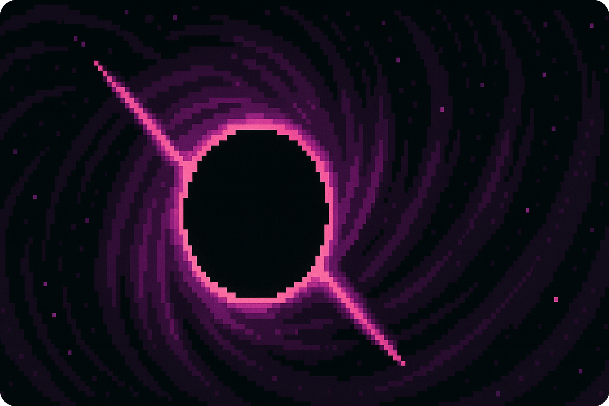
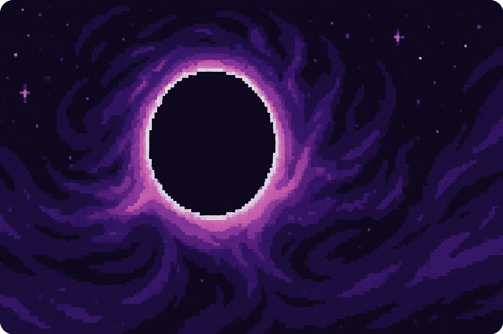

<!-- Banner superior personalizado (puedes subir una imagen estilo espacio o vacío) -->

  

<h1 align="center">🌌 Void Crafters – Product Development</h1>

  <em style="color:#e0d5ff;">Exploring the unknown to build the future.</em>

---

## 🪐 About Us

VoidTech is a <strong style="color:#ffb3ff;">product development</strong> organization focused on building <strong>high-quality software</strong> at an <strong>affordable price</strong>. We leverage the power of <strong>artificial intelligence</strong> and our <strong>deep knowledge of the industry</strong> to deliver innovative solutions.

In our organization:
- 💬 Clients talk **directly with developers**
- 🧠 We use **Design Thinking** to uncover the real needs behind problems
- 💡 We're a team full of ideas, making coordination and execution seamless

---

## 🚀 Extreme Programming (XP)

At VoidTech, we embrace **Extreme Programming (XP)** — a lightweight, highly effective agile methodology that empowers small, focused teams to deliver continuous value.  

### ⚙️ XP Principles We Live By:
- **Pair Programming**: Two minds, one codebase — stronger results through collaboration.
- **Test-Driven Development (TDD)**: Code is always tested first, ensuring reliability and confidence.
- **Continuous Integration**: We merge often, deploy fast, and reduce risk.
- **Refactoring**: Clean, adaptable codebases with long-term sustainability.
- **Customer Involvement**: Real-time feedback through direct collaboration.

> 🧪 *XP helps us move fast without breaking things — the void doesn’t tolerate bugs.*

---

## 🌌 Our Core Values

<table align="center" style="width:100%; border: none;">
  <tr>
    <td align="center">🤖</td>
    <td><strong>AI-Driven Development</strong> We build smarter by embedding intelligent tools and decision-making into our process.</td>
  </tr>
  <tr>
    <td align="center">🛠️</td>
    <td><strong>Direct Client Communication</strong> Real conversations. No layers. What you need, when you need it.</td>
  </tr>
  <tr>
    <td align="center">🧠</td>
    <td><strong>Design Thinking</strong> We uncover what truly matters before writing a single line of code.</td>
  </tr>
  <tr>
    <td align="center">🌠</td>
    <td><strong>Creative Autonomy</strong> We trust our people to imagine, test, and build bold ideas.</td>
  </tr>
</table>

---

<!-- Banner inferior decorativo -->

  

  <em style="color:#e0d5ff;">Void isn’t empty — it’s full of potential.</em> 
  <strong style="color:#c084ff;">— The Void Crafters Team</strong>

